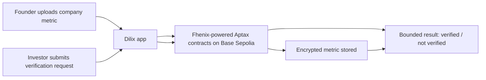

# Aptax

Aptax is a confidential verification stack built on top of Fhenix and CoFHE.

The current flagship product is Dilix, a private due diligence workspace where founders can upload company metrics, investors can request bounded checks, and the system returns only the minimum result needed for the workflow.

Live app: [aptax.vercel.app](https://aptax.vercel.app/)

## Fhenix and CoFHE in Aptax

Fhenix is the cryptographic foundation of this project, not just an implementation detail.

Today, Aptax uses Fhenix and CoFHE for:

- encrypted metric inputs in the Aptax contracts
- encrypted comparison logic for bounded verification requests
- browser-side encryption and permit flows through `@cofhe/sdk`
- founder-only decrypt-for-view flows in the Dilix app
- verifier access to encrypted metrics without exposing the underlying values

In practical terms:

- Fhenix provides the encrypted types and computation primitives
- CoFHE provides the client-side interaction flow used by the app
- Aptax wraps those primitives into a usable verification layer and product workflow

## What the project is

Modern diligence workflows usually require founders to overshare raw data with every investor, advisor, or reviewer who asks for it.

Aptax changes that model:

- Fhenix powers encrypted computation.
- CoFHE powers the app-side encryption, permit, and decrypt interaction flow.
- Aptax provides the verification contracts, integration flow, and product surface.
- Dilix is the first application built on top of that stack.

The result is a workflow where a company can store an encrypted metric once, verify a claim against it, and share the verification outcome without repeatedly exposing the underlying number.

## Architecture



## Repository layout

```text
Aptax/
  dilix-next-app/      # Dilix product app built with Next.js
  fhenix-contracts/    # Aptax verification contracts and deployment scripts
```

## Current scope

Today this repo contains the verification loop:

- subject registration for a company workspace
- encrypted metric storage using Fhenix primitives
- threshold-based verification requests
- a founder workspace for onboarding, company profile, data room, and manual data upload
- an investor workspace for request-oriented diligence flows
- deployment sync so contract ABIs and addresses are copied into the app automatically

Fhenix usage already spans both packages:

- `fhenix-contracts` uses FHE encrypted types and operations inside the Aptax verification contracts
- `dilix-next-app` uses `@cofhe/sdk` for session setup, encryption, permits, and decrypt-for-view flows


## Base Sepolia deployment

The current deployed contracts are on Base Sepolia (`84532`):

- Registry: `0xE79D3fa05aE722a69bbd5c47558C7b4F423Cf23d`
- Metric Store: `0x1849367bA40715d98C4bC107e4c9AAC8392661E9`
- Verifier: `0xA6741DdCd52320921e6513D6310ac0FB5967Ba73`

These addresses are tracked in:

- [fhenix-contracts/deployments/base-sepolia.json](C:\dev\buildathons\fhenix-buildathon\Aptax\fhenix-contracts\deployments\base-sepolia.json)
- [dilix-next-app/lib/aptax/deployments.generated.json](C:\dev\buildathons\fhenix-buildathon\Aptax\dilix-next-app\lib\aptax\deployments.generated.json)

## Quick start

### 1. Install dependencies

```bash
cd fhenix-contracts
npm install

cd ../dilix-next-app
npm install
```

### 2. Configure contract deployment environment

Copy [fhenix-contracts/.env.example](C:\dev\buildathons\fhenix-buildathon\Aptax\fhenix-contracts\.env.example) to `.env` and fill in:

- `PRIVATE_KEY`
- `BASE_SEPOLIA_RPC_URL`

Optional if you also want other testnets:

- `SEPOLIA_RPC_URL`
- `ARBITRUM_SEPOLIA_RPC_URL`

### 3. Configure the app

Create `dilix-next-app/.env.local`.

For the current Base Sepolia deployment, the minimum useful values are:

```env
NEXT_PUBLIC_WALLETCONNECT_PROJECT_ID=your_walletconnect_project_id
NEXT_PUBLIC_NETWORK_CHAIN_ID=84532
NEXT_PUBLIC_NETWORK_RPC_URL=https://sepolia.base.org
```

Notes:

- the app can fall back to generated deployment addresses for Base Sepolia
- you can still override contract addresses explicitly if needed

### 4. Run the app

```bash
cd dilix-next-app
npm run dev
```

Then open `http://localhost:3000`.

### 5. Deploy contracts and sync the app

```bash
cd fhenix-contracts
npm run deploy:base-sepolia
```

That deployment flow:

- deploys `AptaxRegistry`
- deploys `AptaxMetricStore`
- deploys `AptaxVerifier`
- wires the verifier into the metric store
- copies fresh ABIs into `dilix-next-app/lib/aptax/abis.generated.ts`
- updates the generated deployment manifest used by the app

## Product flow today

### Founder flow

- onboard a single company workspace
- review the founder overview
- manage company profile details
- open the data room
- manually upload a company metric as a demo flow
- decrypt the uploaded metric for founder-only viewing

### Investor flow

- browse the investor workspace
- review active requests
- submit verification checks against company data
- consume bounded results instead of raw underlying metrics

## Important implementation notes

- Aptax is a product and verification layer.
- The current deployed network is Base Sepolia.
- Fhenix handles encrypted computation and CoFHE handles the app-side interaction flow; Aptax turns that into a diligence workflow.
- The current upload UI uses manual input for demo clarity.
- The intended production direction is hybrid data ingestion plus an attestation/review layer, so a metric can be verified once and reused across multiple investor workflows with less raw-data exposure.

## Future Fhenix expansion

The current implementation uses Fhenix and CoFHE for the first complete diligence loop, but the expansion path is broader.

Planned or likely next uses include:

- more claim templates beyond simple threshold checks
- richer encrypted policy checks for diligence and readiness workflows
- reusable verification results across more investor requests and rooms
- stronger permissioning and scoped result sharing
- broader verification products beyond diligence, such as treasury policy checks, private compliance checks, and eligibility verification

The long-term goal is not just a diligence app that happens to use Fhenix.

It is a Fhenix-powered verification platform where the same encrypted computation foundation can support more product surfaces, APIs, SDKs, and future agent-native workflows.

## Read more

- [Dilix app README](C:\dev\buildathons\fhenix-buildathon\Aptax\dilix-next-app\README.md)
- [Contracts README](C:\dev\buildathons\fhenix-buildathon\Aptax\fhenix-contracts\README.md)
- [Roadmap](C:\dev\buildathons\fhenix-buildathon\Aptax\internal-docs\roadmap.md)
